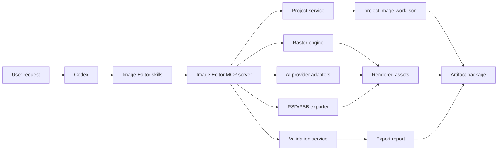

# Image Editor Plugin

## Product, Architecture, Tooling, and Implementation Specification

**Document status:** Proposed  
**Implementation status:** Not started  
**Research date:** July 24, 2026  
**Initial plugin identifier:** `image-editor`  
**Primary surface:** Codex CLI and Codex desktop sessions  
**Video editor:** Explicitly out of scope until the image editor is complete

---

## Contents

1. [Executive summary](#1-executive-summary)
2. [Product vision](#2-product-vision)
3. [Goals](#3-goals)
4. [Non-goals for the first release](#4-non-goals-for-the-first-release)
5. [Terminology](#5-terminology)
6. [Core architectural decisions](#6-core-architectural-decisions)
7. [High-level component model](#7-high-level-component-model)
8. [Proposed repository layout](#8-proposed-repository-layout)
9. [Plugin manifest](#9-plugin-manifest)
10. [Runtime and dependency model](#10-runtime-and-dependency-model)
11. [Canonical project format](#11-canonical-project-format)
12. [MCP tool design principles](#12-mcp-tool-design-principles)
13. [Proposed MCP tool catalog](#13-proposed-mcp-tool-catalog)
14. [AI provider interface](#14-ai-provider-interface)
15. [Raster engine policy](#15-raster-engine-policy)
16. [Color management](#16-color-management)
17. [PSD and PSB export contract](#17-psd-and-psb-export-contract)
18. [Output and artifact package](#18-output-and-artifact-package)
19. [Workflow skills](#19-workflow-skills)
20. [Safety and security](#20-safety-and-security)
21. [Error model](#21-error-model)
22. [Logging and observability](#22-logging-and-observability)
23. [Testing strategy](#23-testing-strategy)
24. [Acceptance criteria for version 1](#24-acceptance-criteria-for-version-1)
25. [Implementation roadmap](#25-implementation-roadmap)
26. [Installation and local development](#26-installation-and-local-development)
27. [Example user workflows](#27-example-user-workflows)
28. [Performance principles](#28-performance-principles)
29. [Versioning and migrations](#29-versioning-and-migrations)
30. [Documentation deliverables](#30-documentation-deliverables)
31. [Decisions deferred until implementation](#31-decisions-deferred-until-implementation)
32. [Recommended first build task](#32-recommended-first-build-task)
33. [Source references](#33-source-references)
34. [Final product boundary](#34-final-product-boundary)

---

## 1. Executive summary

The Image Editor will be a personal Codex plugin that gives Codex a safe,
structured, and reproducible image-production environment. It will combine:

- current, source-attributed web image discovery;
- AI image generation and semantic editing;
- deterministic raster editing such as cropping, resizing, compositing, masks,
  color adjustments, and filters;
- layered project management;
- PNG and JPEG delivery exports;
- layered PSD export using portable `psd-tools`, with PhotoshopAPI retained only as an optional
  accelerated backend;
- artifact provenance, checksums, logs, and validation reports.

The plugin is an orchestration and workflow layer. It is not a replacement for
the underlying image-processing engines. Codex will call structured MCP tools,
and those tools will use purpose-built engines:

- ImageMagick for deterministic raster operations;
- psd-tools for portable PSD structures and optional PhotoshopAPI acceleration;
- OpenAI hosted Image Search for external visual discovery;
- provider adapters for AI image generation and semantic editing.

The canonical source of truth will be a versioned Image Editor project manifest,
not a flattened PNG or a PSD file. This preserves edit history, reproducibility,
export settings, layer identities, prompts, and asset provenance independently
of the limitations of any one output format.

The first implementation milestone is deliberately small:

```text
inspect -> crop or resize -> add layer -> composite -> export PNG and JPEG
```

PSD export and AI editing will be added only after that deterministic vertical
slice is stable and fully tested.

---

## 2. Product vision

The user should be able to give Codex outcome-oriented instructions such as:

```text
Create a 1600x900 product banner using these two images.
Remove the background from the product, place it on the right,
add a soft shadow, preserve the brand colors, and export PNG,
high-quality JPG, and a layered PSD.
```

Codex should then:

1. Inspect the input assets.
2. Create a project with explicit canvas and color settings.
3. Plan the edit as a sequence of structured operations.
4. Use AI only for semantic work that cannot be performed reliably with
   deterministic geometry or compositing.
5. Preserve generated and imported assets as named layers.
6. Render previews for inspection.
7. Validate the final raster and layered deliverables.
8. Produce a complete artifact package with provenance and checksums.

The same project must be rerenderable in a later Codex session without depending
on hidden chat state.

---

## 3. Goals

### 3.1 Functional goals

- Generate new images from text prompts.
- Edit existing images using natural-language instructions.
- Support masked AI edits, inpainting, and outpainting.
- Remove, replace, or generate backgrounds.
- Perform deterministic crop, resize, rotate, flip, trim, extend, and transform
  operations.
- Create layered compositions from multiple source images.
- Create, edit, reorder, group, rename, hide, and show layers.
- Support layer opacity, blend modes, masks, and pixel-level composition.
- Provide common photographic and graphic adjustments.
- Export flattened PNG and JPEG deliverables.
- Export layered PSD files through `psd-tools`; use PhotoshopAPI only as an isolated optional
  acceleration backend on compatible CPUs.
- Preserve ICC profile and color-space metadata where supported.
- Generate previews, manifests, provenance records, checksums, and export
  reports.
- Operate from Codex CLI and Codex desktop after plugin installation.

### 3.2 Engineering goals

- Reproducible deterministic edits.
- Immutable source assets.
- Workspace-scoped file access.
- Explicit overwrite behavior.
- Structured tool schemas instead of free-form shell commands.
- Versioned project and operation schemas.
- Provider-neutral AI integration.
- Cancellation and progress reporting for long operations.
- Actionable failure reports.
- Cross-platform design for Windows, Linux, and macOS where dependencies permit.

### 3.3 Quality goals

- Correct alpha compositing.
- Predictable output dimensions.
- Explicit color-management decisions.
- No silent flattening of layers during PSD export.
- No silent degradation of unsupported PSD structures.
- Visual comparison and structural validation of exports.
- Stable, documented artifact layouts.

---

## 4. Non-goals for the first release

The first release will not attempt to:

- replicate every Photoshop feature;
- implement a graphical desktop editor;
- provide real-time brush painting;
- provide a clone-stamp or healing-brush user interface;
- write arbitrary Photoshop binary structures not supported by PhotoshopAPI;
- guarantee compatibility with every third-party PSD reader;
- create native Photoshop adjustment layers when the library cannot represent
  them;
- create native vector masks before PhotoshopAPI supports them;
- execute arbitrary ImageMagick, Python, or shell commands supplied by a model;
- manage video, audio, animation, timelines, OTIO, AEP, or OpenEXR sequences;
- train custom image-generation models;
- hide AI provenance or bypass provider safety rules.

---

## 5. Terminology

### 5.1 Codex plugin

A Codex plugin is an installable bundle that may include skills, MCP server
configuration, scripts, assets, app wiring, and presentation metadata. The
required entry point is:

```text
.codex-plugin/plugin.json
```

The Image Editor plugin will bundle workflow skills and a local MCP server.
Installed capabilities are picked up by a new Codex session.

Reference: [Build plugins](https://learn.chatgpt.com/docs/build-plugins)

### 5.2 MCP tool

An MCP tool is a structured callable operation exposed to Codex. Each tool has a
name, description, input schema, and structured response. An MCP tool is not a
shell alias. The server owns validation, execution, logging, and safe path
resolution.

#### 5.2.1 Web image search

Web image search is read-only discovery through OpenAI's Responses API hosted
`web_search` tool. It returns canonical image URLs together with source-page
URLs, thumbnails, captions, and optional supporting citations. Search results
remain external references until a user separately reviews and authorizes
acquisition; the plugin does not infer licensing or automatically import them.

### 5.3 AI image generation

AI image generation creates a new raster image from a prompt and optional
reference images. Generated output is an asset; it is not automatically a full
editable layered project.

OpenAI currently provides image generation and editing through the Image API and
conversational image workflows through the Responses API.

Reference:
[OpenAI image generation](https://developers.openai.com/api/docs/guides/image-generation)

### 5.4 AI image editing

AI image editing changes image semantics, for example:

- removing an object;
- replacing a background;
- changing a person's clothing;
- adding a new object;
- reconstructing a masked area;
- extending an image beyond its original canvas.

AI masks are guidance to a model and may not be followed with pixel-perfect
geometry. Exact geometric work must use deterministic tools.

### 5.5 Deterministic editing

A deterministic edit produces the same result when the same input bytes,
parameters, engine version, and color configuration are used. Examples include
crop, resize, rotation, compositing, opacity changes, and channel operations.

### 5.6 Crop

Cropping removes pixels outside explicit bounds. The bounds may be expressed in
pixels or normalized coordinates. Crop is different from resizing: cropping
changes framing, while resizing changes resolution.

### 5.7 Composite and merge

Compositing combines images using positions, masks, alpha, opacity, and blend
modes. Merging may preserve separate project layers or create a new rasterized
layer. Flattening combines the visible result into a single raster image.

### 5.8 Mask

A mask controls which pixels of a layer or operation are visible or affected.
The project will initially support raster or pixel masks. Vector masks are not
part of the initial PSD contract.

### 5.9 Alpha channel

Alpha represents opacity. Zero normally means fully transparent; the maximum
value means fully opaque. PNG supports alpha. Standard JPEG does not.

### 5.10 PNG

PNG is a lossless raster format that supports grayscale, indexed color,
truecolor, transparency, color information, and metadata. It is the default
flattened master format for the plugin.

Reference: [PNG Specification, Third Edition](https://www.w3.org/TR/png-3/)

### 5.11 JPG and JPEG

`.jpg` and `.jpeg` refer to the same common JPEG image format. The three-letter
extension is historical. JPEG is normally lossy and is appropriate for compact
photographic delivery. It does not preserve project layers or standard alpha
transparency.

### 5.12 PSD

PSD is Adobe Photoshop's primary layered document format. It may preserve
layers, text, masks, effects, channels, and other editable structures. Adobe
documents a 2 GB PSD limit. Larger documents should use PSB.

References:

- [Photoshop file formats overview](https://helpx.adobe.com/photoshop/desktop/save-and-export/export-files-to-different-formats/photoshop-file-formats-overview.html)
- [Adobe Photoshop File Formats Specification](https://www.adobe.com/devnet-apps/photoshop/fileformatashtml/)

### 5.13 PSB

PSB is Photoshop's Large Document Format. It is intended for documents exceeding
PSD's size or dimension limits. The plugin may select PSB automatically when a
document cannot be represented safely as PSD, but automatic selection must be
reported to the user.

### 5.14 PhotoshopAPI

PhotoshopAPI is an independent C++20 library with Python bindings for PSD and
PSB reading, writing, and editing. Its documented supported features include:

- nested layer structures;
- editable text layers;
- smart objects;
- pixel masks;
- layer properties and blend modes;
- display ICC profiles;
- 8-, 16-, and 32-bit data;
- RGB, CMYK, and grayscale modes;
- Photoshop compression modes.

The project currently labels itself early-development. Adjustment layers and
vector masks are planned, not supported. It also documents a missing valid
merged-image representation in generated files, which affects some third-party
applications.

References:

- [PhotoshopAPI repository](https://github.com/EmilDohne/PhotoshopAPI)
- [PhotoshopAPI documentation](https://photoshopapi.readthedocs.io/en/latest/)

---

## 6. Core architectural decisions

### 6.1 Two editing domains

The plugin will separate operations into two domains:

1. **Deterministic operations**
   - geometry;
   - compositing;
   - masks;
   - channels;
   - color conversion;
   - filters;
   - metadata;
   - file export.

2. **Generative operations**
   - text-to-image;
   - semantic replacement;
   - inpainting;
   - outpainting;
   - background generation;
   - prompt-guided variations.

The agent must prefer deterministic operations when the requested change can be
expressed exactly. For example, "crop 100 pixels from the left" must never be
implemented by an AI image edit.

### 6.2 Canonical project manifest

The canonical project will be stored in:

```text
project.image-work.json
```

This manifest records the document model, operations, assets, provenance, and
exports. PSD is a deliverable and an import source, not the only source of truth.

### 6.3 Immutable inputs

Imported files are copied or content-addressed into the project asset store.
Operations never modify the original user file in place.

### 6.4 Structured operations

Every edit is represented as a typed operation with:

- operation ID;
- operation type;
- input layer or asset IDs;
- validated parameters;
- engine name and version;
- output layer or asset IDs;
- timestamp;
- status;
- warnings;
- deterministic or generative classification.

### 6.5 Provider-neutral AI

The project model must not depend on one AI vendor. Provider adapters implement
a common contract. A project records which adapter, model, and parameters
created each generated asset.

### 6.6 Explicit compatibility

Unsupported PSD concepts must never be silently discarded. The exporter must
choose one of:

- preserve natively;
- rasterize into a named pixel layer;
- omit with an explicit error;
- omit only with user-approved degradation.

---

## 7. High-level component model



### 7.1 Codex skills

Skills teach Codex how to:

- inspect before editing;
- choose deterministic versus generative operations;
- preserve non-destructive project structure;
- iterate with previews;
- validate exports;
- communicate degradations and warnings.

### 7.2 MCP server

The MCP server:

- validates all tool arguments;
- resolves safe workspace paths;
- owns job state;
- invokes editing engines;
- emits progress;
- records operations;
- returns structured results;
- prevents arbitrary command execution.

### 7.3 Project service

The project service owns:

- project creation and loading;
- schema migrations;
- layer and asset identity;
- operation history;
- undo and redo;
- project locking;
- atomic manifest writes;
- artifact paths.

### 7.4 Raster engine

ImageMagick is the initial deterministic engine because it supports a broad set
of formats and operations including crop, resize, compositing, layers, filters,
color-space conversion, and image comparison.

References:

- [ImageMagick command-line processing](https://imagemagick.org/command-line-processing/)
- [ImageMagick command-line options](https://imagemagick.org/command-line-options/)
- [ImageMagick image formats](https://imagemagick.com/formats/)

ImageMagick commands are constructed internally from validated data. The MCP
interface will not expose a raw command string.

### 7.5 PSD and PSB exporter

The portable exporter maps the canonical document to `psd-tools` pixel layers. It preserves the
supported 8-bit sRGB raster contract and validates a structural reopen. PhotoshopAPI is optional
acceleration only: probing and export occur in isolated child processes, and a native failure falls
back to the portable exporter without affecting the MCP server or existing delivery.

### 7.6 Validation service

Validation includes:

- file existence and size;
- image decode;
- expected dimensions;
- channel and alpha checks;
- color-profile checks;
- layer-tree round trip;
- pixel comparison;
- file signature verification;
- checksums;
- optional Photoshop compatibility testing.

---

## 8. Proposed repository layout

The recommended development arrangement is a dedicated media-plugin repository,
not a hidden folder inside the ProboxAI control-plane source. Until that
repository exists, this document remains the source specification.

```text
media-plugins/
├── README.md
├── plugins/
│   └── image-editor/
│       ├── .codex-plugin/
│       │   └── plugin.json
│       ├── .mcp.json
│       ├── skills/
│       │   ├── image-search/
│       │   │   └── SKILL.md
│       │   ├── image-create/
│       │   │   └── SKILL.md
│       │   ├── image-edit/
│       │   │   └── SKILL.md
│       │   ├── image-compose/
│       │   │   └── SKILL.md
│       │   ├── image-psd-export/
│       │   │   └── SKILL.md
│       │   ├── poster-create/
│       │   │   └── SKILL.md
│       │   └── image-deliver/
│       │       └── SKILL.md
│       ├── server/
│       │   ├── __init__.py
│       │   ├── main.py
│       │   ├── config.py
│       │   ├── errors.py
│       │   ├── tools/
│       │   ├── project/
│       │   ├── engines/
│       │   ├── providers/
│       │   ├── exporters/
│       │   ├── validation/
│       │   └── security/
│       ├── schemas/
│       ├── scripts/
│       ├── assets/
│       ├── fixtures/
│       ├── tests/
│       │   ├── unit/
│       │   ├── integration/
│       │   ├── golden/
│       │   └── compatibility/
│       ├── pyproject.toml
│       ├── README.md
│       └── CHANGELOG.md
├── marketplace/
└── docs/
```

Each released plugin must be self-contained. Shared development packages may
exist in the monorepo, but a plugin release must not depend on an undocumented
sibling checkout.

---

## 9. Plugin manifest

The plugin manifest will initially declare skills and an MCP server. App wiring
and hooks must not be added unless their companion components exist and are
supported by the active validator.

Proposed shape:

```json
{
  "name": "image-editor",
  "version": "0.1.0",
  "description": "Generate, edit, compose, validate, and export layered image projects.",
  "author": {
    "name": "Shakhzod"
  },
  "license": "UNLICENSED",
  "keywords": [
    "images",
    "editing",
    "photoshop",
    "psd",
    "generation"
  ],
  "skills": "./skills/",
  "mcpServers": "./.mcp.json",
  "interface": {
    "displayName": "Image Editor",
    "shortDescription": "AI and deterministic layered image editing",
    "longDescription": "Create, edit, composite, validate, and export PNG, JPEG, PSD, and PSB image projects.",
    "developerName": "Shakhzod",
    "category": "Creativity",
    "capabilities": [
      "Generate",
      "Edit",
      "Write"
    ],
    "defaultPrompt": [
      "Create a layered image from these assets.",
      "Edit this image and preserve a PSD.",
      "Export PNG, JPG, and layered PSD."
    ]
  }
}
```

Publisher URLs, legal URLs, icons, logos, and screenshots will be added only
after the project has real values and real files.

---

## 10. Runtime and dependency model

### 10.1 Primary runtime

Python is the primary runtime because:

- PhotoshopAPI provides Python bindings;
- NumPy arrays map naturally to image channels;
- AI SDKs and HTTP clients are mature;
- the MCP server can remain in the same process as the document and export
  logic.

### 10.2 Required dependencies

Expected initial dependencies:

- Python 3.11 or newer;
- PhotoshopAPI;
- NumPy;
- an MCP Python SDK;
- a schema-validation library;
- an HTTP client;
- ImageMagick;
- provider SDKs selected during implementation.

### 10.3 Optional dependencies

Potential later dependencies:

- OpenCV for advanced geometric or vision operations;
- OCR tooling;
- subject segmentation models;
- LittleCMS or OpenColorIO integration;
- native Adobe Photoshop for compatibility round trips.

### 10.4 Dependency preflight

The plugin will expose a `system_preflight` tool that reports:

- Python version;
- operating system and architecture;
- PhotoshopAPI availability and version;
- ImageMagick availability, version, and delegates;
- available AI providers;
- required environment-variable presence without exposing secret values;
- writable workspace and temporary directories;
- available disk space;
- optional Photoshop installation detection.

Preflight never prints secrets.

---

## 11. Canonical project format

### 11.1 Project directory

```text
my-project.image-work/
├── project.image-work.json
├── assets/
│   ├── imported/
│   ├── generated/
│   ├── masks/
│   └── derived/
├── previews/
├── exports/
├── logs/
├── cache/
└── locks/
```

### 11.2 Manifest example

The exact JSON Schema will be versioned during implementation. The conceptual
shape is:

```json
{
  "schema_version": "1.0.0",
  "project_id": "imgproj_01",
  "name": "Product Banner",
  "created_at": "2026-07-24T12:00:00Z",
  "updated_at": "2026-07-24T12:05:00Z",
  "document": {
    "width": 1600,
    "height": 900,
    "bit_depth": 8,
    "color_mode": "RGB",
    "working_color_space": "sRGB",
    "background": {
      "type": "transparent"
    }
  },
  "assets": [
    {
      "id": "asset_product",
      "kind": "imported",
      "path": "assets/imported/product.png",
      "sha256": "example",
      "mime_type": "image/png",
      "width": 1200,
      "height": 1200,
      "has_alpha": true
    }
  ],
  "layers": [
    {
      "id": "layer_product",
      "type": "pixel",
      "name": "Product",
      "asset_id": "asset_product",
      "visible": true,
      "opacity": 1.0,
      "blend_mode": "normal",
      "transform": {
        "x": 850,
        "y": 90,
        "scale_x": 0.6,
        "scale_y": 0.6,
        "rotation_degrees": 0
      },
      "masks": []
    }
  ],
  "operations": [],
  "exports": [],
  "provenance": {
    "created_by": "image-editor",
    "plugin_version": "0.1.0"
  }
}
```

### 11.3 Layer types

Initial layer types:

- pixel;
- group;
- text;
- smart-object reference;
- generated asset;
- mask-only helper;
- flattened composite.

Possible future layer types:

- vector shape;
- native adjustment layer;
- linked external asset;
- procedural fill.

### 11.4 Coordinates

The project uses a top-left origin:

- positive X moves right;
- positive Y moves down;
- width and height are integer pixels;
- normalized tool inputs are converted to document pixels and recorded as both
  source and resolved values where useful.

### 11.5 Operation history

Operations are append-only records. Undo changes the active operation head
rather than deleting history. Destructive compaction, when introduced, must
create a new project revision and preserve an audit record.

---

## 12. MCP tool design principles

### 12.1 Naming

Tool names use clear verbs and nouns:

```text
project_create
image_inspect
layer_add
transform_crop
export_render
```

### 12.2 Structured arguments

Tools accept explicit values. They do not accept free-form shell fragments.

Bad:

```json
{
  "command": "magick input.png -crop ... output.png"
}
```

Good:

```json
{
  "project_id": "imgproj_01",
  "layer_id": "layer_product",
  "bounds": {
    "x": 100,
    "y": 50,
    "width": 800,
    "height": 600
  },
  "mode": "non_destructive"
}
```

### 12.3 Standard response

Every tool returns a consistent envelope:

```json
{
  "ok": true,
  "job_id": "job_01",
  "project_id": "imgproj_01",
  "operation_id": "op_12",
  "outputs": [],
  "warnings": [],
  "metrics": {
    "duration_ms": 420
  }
}
```

Failures include a stable error code, user-safe message, technical details,
retryability, and remediation hints.

### 12.4 Long-running jobs

AI generation, large exports, and PSD writes may run as cancellable jobs. The
tool surface must support:

- start;
- status;
- progress;
- cancel;
- result retrieval.

---

## 13. Proposed MCP tool catalog

The following catalog is the target surface. Tools may be introduced gradually.

### 13.1 System tools

#### `system_preflight`

Checks runtime, dependencies, providers, workspace access, and disk resources.

#### `system_capabilities`

Returns supported formats, operations, blend modes, AI providers, PSD features,
and known limitations for the installed version.

#### `system_diagnostics`

Returns sanitized diagnostics for a failed job.

### 13.2 Project tools

#### `project_create`

Creates a project with canvas size, color mode, bit depth, working color space,
and background.

#### `project_open`

Loads and validates an existing project.

#### `project_inspect`

Returns document settings, layer tree, assets, history head, and warnings.

#### `project_clone`

Creates a safe editable copy.

#### `project_save`

Atomically writes the current manifest.

#### `project_undo`

Moves the active history head backward.

#### `project_redo`

Moves the active history head forward.

#### `project_validate`

Checks schema, paths, assets, layer references, dimensions, and export readiness.

#### `project_close`

Releases locks and optionally clears disposable caches.

### 13.3 Asset tools

#### `asset_import`

Imports an image into the content-addressed asset store.

#### `asset_inspect`

Returns format, dimensions, channels, alpha, bit depth, profile, metadata, and
checksum.

#### `asset_list`

Lists imported, generated, derived, and unused assets.

#### `asset_replace`

Replaces a project asset while preserving a stable asset or layer identity when
compatible.

#### `asset_remove`

Removes an unreferenced asset. Referenced assets require explicit handling.

#### `asset_export_copy`

Exports an original or derived asset without changing the project.

### 13.4 Layer tools

#### `layer_add`

Adds a pixel, text, group, generated, or smart-object layer.

#### `layer_duplicate`

Duplicates a layer and its project-level properties.

#### `layer_remove`

Removes a layer through an undoable operation.

#### `layer_rename`

Changes the layer's stable display name.

#### `layer_reorder`

Moves a layer before, after, or inside another layer or group.

#### `layer_group`

Creates a group from selected layers.

#### `layer_ungroup`

Moves group children to the parent and removes the group.

#### `layer_set_visibility`

Shows or hides a layer.

#### `layer_set_opacity`

Sets opacity in the inclusive range from 0 to 1.

#### `layer_set_blend_mode`

Sets a supported blend mode.

#### `layer_rasterize`

Creates a pixel-layer representation of a non-pixel layer while preserving the
original unless explicitly requested.

#### `layer_flatten_visible`

Creates a new flattened layer from visible layers.

### 13.5 Geometry and transform tools

#### `transform_crop`

Crops a layer or the document canvas using pixel or normalized bounds.

#### `transform_resize`

Resizes a layer or canvas with an explicit filter and aspect-ratio policy.

#### `transform_rotate`

Rotates by degrees with explicit expansion and background behavior.

#### `transform_flip`

Flips horizontally or vertically.

#### `transform_trim`

Trims transparent or selected-color borders.

#### `transform_extend_canvas`

Expands the canvas with transparency, a solid color, an existing image, or a
later AI outpainting step.

#### `transform_position`

Moves a layer to explicit coordinates or an alignment anchor.

#### `transform_scale`

Scales a layer with independent or locked axes.

#### `transform_perspective`

Maps source corners to destination corners.

#### `transform_distort`

Applies supported deterministic distortion parameters.

### 13.6 Selection and mask tools

#### `mask_create_rectangle`

Creates a rectangular raster mask.

#### `mask_create_ellipse`

Creates an elliptical raster mask.

#### `mask_create_polygon`

Creates a polygonal raster mask.

#### `mask_from_alpha`

Creates a mask from a layer's alpha channel.

#### `mask_from_luminance`

Creates a mask from luminance.

#### `mask_from_color_range`

Creates a mask from selected colors and tolerance.

#### `mask_invert`

Inverts a mask.

#### `mask_feather`

Softens mask edges.

#### `mask_expand`

Expands the selected region.

#### `mask_contract`

Contracts the selected region.

#### `mask_apply`

Attaches a mask to a layer or destructively applies it when explicitly
requested.

#### `mask_remove`

Removes a mask while optionally preserving its raster asset.

### 13.7 Composition tools

#### `composite_overlay`

Places one layer over another with transform, opacity, blend mode, and mask.

#### `composite_montage`

Builds a grid or contact sheet.

#### `composite_align`

Aligns selected layers to the canvas or another layer.

#### `composite_distribute`

Distributes layers with equal spacing.

#### `composite_merge`

Creates a merged result from selected layers.

#### `composite_add_border`

Adds an inside, centered, or outside border.

#### `composite_add_shadow`

Adds a configurable raster shadow as a separate layer.

#### `composite_add_watermark`

Adds an image or text watermark as a named layer.

#### `composite_replace_region`

Replaces a selected region with another deterministic asset.

### 13.8 Adjustment tools

Initial adjustments are represented in project history and rendered into pixel
results. They are not promised as native Photoshop adjustment layers.

#### `adjust_brightness_contrast`

Adjusts brightness and contrast.

#### `adjust_exposure`

Adjusts exposure and related parameters supported by the raster engine.

#### `adjust_gamma`

Applies gamma correction.

#### `adjust_levels`

Maps input black, white, and midpoint to output levels.

#### `adjust_curves`

Applies per-channel curve control points.

#### `adjust_hue_saturation`

Adjusts hue, saturation, and lightness.

#### `adjust_color_balance`

Adjusts color balance across tonal ranges.

#### `adjust_white_balance`

Applies temperature and tint corrections where supported.

#### `adjust_grayscale`

Converts using an explicit luminance strategy.

#### `adjust_invert`

Inverts selected channels.

#### `adjust_channel_mixer`

Builds output channels from weighted input channels.

#### `adjust_color_space`

Converts between supported color spaces using an explicit profile policy.

### 13.9 Filter tools

#### `filter_blur`

Applies Gaussian or another supported blur.

#### `filter_sharpen`

Applies controlled sharpening.

#### `filter_denoise`

Reduces noise with an explicit strength.

#### `filter_add_noise`

Adds deterministic noise with a recorded seed.

#### `filter_grain`

Adds stylized film-like grain with a recorded seed.

#### `filter_pixelate`

Applies pixelation.

#### `filter_emboss`

Applies an emboss effect.

#### `filter_edge_detect`

Creates an edge-detection result.

#### `filter_morphology`

Applies supported erosion, dilation, opening, or closing operations.

### 13.10 Image discovery, AI generation, and editing tools

#### `image_search`

Uses OpenAI Image Search to return current, source-attributed image references.
The default Responses model is `gpt-5.6`; agents may choose another model that
supports `web_search` image results. Bounded options cover captions, supporting
text, domain filters, approximate location, search context, and live/cache-only
access. The tool is read-only and never downloads results.

#### `ai_generate_image`

Creates one or more images from a prompt, size, quality, background preference,
and provider configuration.

#### `ai_edit_image`

Edits one or more input images using a natural-language instruction.

#### `ai_inpaint`

Edits a masked region. The result is stored as a generated asset and normally
added as a new layer.

#### `ai_outpaint`

Generates content for an expanded canvas.

#### `ai_remove_object`

Removes a described or masked object and reconstructs the region.

#### `ai_replace_object`

Replaces a described or masked object.

#### `ai_remove_background`

Creates a subject cutout with transparency when supported.

#### `ai_replace_background`

Replaces the background while attempting to preserve the subject.

#### `ai_generate_variations`

Generates related alternatives from an input image.

#### `ai_continue_edit`

Continues a provider-supported multi-turn edit while recording remote response
or image identifiers required for continuity.

### 13.11 Inspection and comparison tools

#### `image_inspect`

Returns technical image properties.

#### `image_histogram`

Returns bounded histogram information.

#### `image_compare`

Compares images using explicit metrics and optionally writes a difference image.

#### `image_sample_pixels`

Returns pixel values at bounded coordinates without dumping an entire image.

#### `image_render_preview`

Renders a preview of the current project or selected layers.

#### `image_contact_sheet`

Builds a review sheet from candidate outputs.

### 13.12 Export tools

#### `export_png`

Exports a flattened PNG with explicit alpha, bit-depth, profile, and metadata
settings.

#### `export_jpeg`

Exports a flattened JPEG with explicit quality, chroma-subsampling, background,
profile, and metadata settings.

#### `export_psd`

Exports a layered PSD when within supported limits.

#### `export_psb`

Exports a layered PSB.

#### `export_thumbnail`

Exports a bounded preview thumbnail.

#### `export_package`

Builds the complete deliverable directory or archive.

#### `export_validate`

Runs format, raster, layer, profile, checksum, and compatibility checks.

### 13.13 Job tools

#### `job_status`

Returns current state and progress.

#### `job_cancel`

Requests cancellation.

#### `job_result`

Returns completed output metadata.

#### `job_list`

Lists recent project jobs without exposing unrelated workspaces.

---

## 14. AI provider interface

### 14.1 Provider contract

Each provider adapter declares:

- provider ID;
- supported operations;
- supported input formats;
- maximum input count and size;
- supported output sizes;
- output formats;
- transparency support;
- mask requirements;
- asynchronous or synchronous behavior;
- model identifiers;
- safety and moderation behavior;
- retry policy;
- cost metadata when available.

### 14.2 OpenAI adapter

The OpenAI adapter uses `gpt-image-2` and supports:

- image generation;
- whole-image editing;
- masked editing;
- multiple input images where supported;
- conversational continuation by resubmitting the latest immutable project asset;
- PNG or JPEG generation output.

The independent OpenAI Image Search service uses `POST /v1/responses` with a
required `web_search` tool call, `search_content_types` containing `image`, and
`include: ["web_search_call.results"]`.

The plugin requests lossless PNG by default. Provider output is stored
immutably, decoded and inspected before commit, and kept in its declared PNG or
JPEG form for deterministic composition.

GPT Image 2 masked edits require an alpha PNG matching the first input image.
The adapter does not send `input_fidelity` because this model always processes
image inputs at high fidelity. Transparent output is not advertised for this
model.

### 14.3 Google and Fal adapters

The Google adapter uses the Interactions API and supports:

- Nano Banana 2 (`gemini-3.1-flash-image`);
- Nano Banana Pro (`gemini-3-pro-image`);
- generation and reference-image editing;
- native multi-turn continuation through `previous_interaction_id`;
- provider-defined aspect ratios and 0.5K/1K/2K/4K resolution tiers where
  supported by the selected model.

The Fal adapter supports:

- Seedream 5.0 Pro generation and editing through
  `bytedance/seedream/v5/pro/text-to-image` and
  `bytedance/seedream/v5/pro/edit`;
- Grok Imagine through `xai/grok-imagine-image`, restricted to image
  generation by plugin policy;
- Qwen Image Layered through `fal-ai/qwen-image-layered`, exposed as semantic
  layer decomposition rather than general generation or editing.

The runtime model catalog owns capability gates. Unsupported provider, model,
operation, option, mask, and input-count combinations fail before a network
request.

### 14.4 Secrets

API keys:

- are read from approved environment configuration;
- are never written to the project manifest;
- are never returned by preflight or diagnostic tools;
- are never included in prompts, logs, or provenance;
- are referenced only by a non-secret provider configuration name.

The supported environment variables are `OPENAI_API_KEY`, `GEMINI_API_KEY`,
and `FAL_KEY` (`FAL_API_KEY` is accepted as a compatibility alias). Codex
product authentication is not exposed as an OpenAI Platform API key.

### 14.5 Provenance

Each generated asset records:

```json
{
  "provider": "openai",
  "model": "resolved-model-id",
  "operation": "image_edit",
  "prompt": "Replace the background with a neutral studio background.",
  "input_asset_ids": [
    "asset_product"
  ],
  "mask_asset_id": "mask_background",
  "provider_request_id": "sanitized-id",
  "created_at": "2026-07-24T12:00:00Z"
}
```

The provider request ID is retained only when permitted and useful for support.

---

## 15. Raster engine policy

### 15.1 Safe command construction

ImageMagick arguments are constructed from validated typed values. The server
must:

- invoke the executable without a shell;
- reject unrecognized options;
- separate input and output paths from operator arguments;
- block protocol or pseudo-image inputs unless explicitly approved;
- set resource limits;
- use project-scoped temporary directories;
- capture stderr and exit status;
- record the ImageMagick version.

### 15.2 Deterministic seeds

Any operation involving pseudo-randomness records a seed. Rerenders reuse that
seed.

### 15.3 Intermediate format

Lossless PNG is the default raster intermediate for 8-bit and 16-bit workflows
where appropriate. A different internal representation may be required for
32-bit floating-point projects and must be explicit.

### 15.4 Metadata

Metadata preservation is opt-in by class:

- ICC profile;
- resolution;
- orientation;
- creation metadata;
- textual metadata;
- EXIF;
- XMP.

Sensitive metadata such as GPS location should not be copied blindly.

---

## 16. Color management

### 16.1 Default working space

The default v1 working space is sRGB for predictable web and general-purpose
delivery.

### 16.2 Explicit conversion

The project records:

- input embedded profile;
- assumed profile when missing;
- working space;
- rendering intent when applicable;
- output profile;
- whether a conversion or simple tag operation occurred.

### 16.3 PNG export

PNG export defaults:

- preserve alpha;
- lossless compression;
- embed the selected output profile;
- preserve 8-bit or 16-bit depth when supported and requested.

### 16.4 JPEG export

JPEG export defaults:

- flatten transparency onto an explicit background;
- sRGB output unless another profile is requested;
- explicit quality;
- explicit metadata policy;
- no accidental repeated lossy re-encoding in the working pipeline.

### 16.5 PSD export

PSD export uses the project's chosen RGB, CMYK, or grayscale mode and supported
bit depth. Unsupported conversions must fail or warn before writing the final
file.

---

## 17. PSD and PSB export contract

### 17.1 Preserve when supported

The exporter should preserve:

- layer names;
- layer order;
- nested groups;
- visibility;
- opacity;
- supported blend modes;
- pixel data;
- pixel masks;
- supported text layers;
- supported smart objects;
- supported ICC profile and bit depth.

### 17.2 Rasterize when necessary

The following may initially be rasterized:

- deterministic adjustment history;
- effects not representable by the supported portable pixel-layer model;
- complex generated composites;
- unsupported text layout;
- unsupported vector content.

Rasterized layers must have descriptive names, for example:

```text
Color Grade (Rasterized)
AI Background Replacement
Shadow Effect (Rasterized)
```

### 17.3 Fail rather than corrupt

Export must fail when:

- dimensions or size exceed PSD and PSB is not allowed;
- a required source asset is missing;
- the layer graph is invalid;
- a bit depth cannot be represented safely;
- a required color conversion fails;
- the written file cannot be read back by the selected structural validator.

### 17.4 Merged-image limitation

Portable PSD exports are structurally validated but do not claim universal third-party rendering.
Therefore:

- `export-report.json` must include this compatibility warning;
- the artifact package includes a flattened PNG preview;
- initial acceptance is structural, not a claim for Photoshop, Lightroom, or every PSD parser;
- an optional native Photoshop round trip may later regenerate compatibility
  data for users with Photoshop installed.

### 17.5 Compatibility tiers

Proposed compatibility labels:

- `psd-tools-roundtrip`: written and read back successfully by the portable backend;
- `photoshopapi-roundtrip`: written and read back successfully by the optional native backend;
- `photoshop-opened`: opened successfully in a supported Adobe Photoshop
  compatibility test;
- `third-party-merged-preview`: a selected third-party reader displayed the
  merged preview correctly;
- `unverified`: structural checks passed, but no native application test ran.

---

## 18. Output and artifact package

### 18.1 Standard package

```text
result/
├── final.png
├── final.jpg
├── final.psd
├── preview.png
├── project.image-work.json
├── assets/
│   ├── imported/
│   ├── generated/
│   └── masks/
├── provenance.json
├── checksums.json
├── export-report.json
└── README.md
```

`final.psb` replaces or supplements `final.psd` when needed.

### 18.2 Export report

The report contains:

- plugin and dependency versions;
- project revision;
- requested and produced formats;
- dimensions and bit depth;
- profiles;
- layer count;
- rasterized feature list;
- omitted feature list;
- compatibility tier;
- validation results;
- warnings;
- durations;
- final file sizes.

### 18.3 Checksums

SHA-256 checksums cover final deliverables and project-critical assets.

### 18.4 Package README

The package README briefly explains:

- which file is the flattened master;
- which file is the compact delivery version;
- whether PSD or PSB is layered;
- compatibility warnings;
- how to reproduce the export from the project manifest.

---

## 19. Workflow skills

### 19.0 `image-search`

Used for current visual research before asset creation or editing.

Workflow:

1. Verify OpenAI credential presence without exposing the key.
2. Choose the default or another compatible Responses model.
3. Search with bounded captions, filters, location, and live-access controls.
4. Present image and source-page URLs together with supporting citations.
5. Review source rights before any separately authorized download or import.

### 19.1 `image-create`

Used when creating an image from scratch.

Workflow:

1. Clarify dimensions, purpose, and required formats when missing and material.
2. Create the project.
3. Generate candidate images.
4. Preserve all selected candidates as assets.
5. Add the chosen candidate as a named layer.
6. Perform deterministic finishing.
7. Preview and validate.
8. Export the requested package.

### 19.2 `image-edit`

Used for edits to an existing image.

Workflow:

1. Inspect the source.
2. Determine whether the edit is deterministic or semantic.
3. Preserve the source asset.
4. Create a mask or selection when needed.
5. Apply the smallest sufficient operation.
6. Compare before and after.
7. Preserve a reversible layer arrangement.
8. Export.

### 19.3 `image-compose`

Used for banners, collages, product layouts, and multi-asset compositions.

Workflow:

1. Inspect all assets.
2. Establish canvas and safe areas.
3. Build groups and layer naming.
4. Perform background work.
5. Position primary subjects.
6. Add effects and typography.
7. Render review previews.
8. Validate dimensions, alpha, margins, and readability.

### 19.4 `image-psd-export`

Used when a layered Photoshop deliverable is required.

Workflow:

1. Run PSD capability analysis.
2. List native, rasterized, unsupported, and risky features.
3. Resolve blocking degradations.
4. Export PSD or PSB.
5. Read the file back.
6. Compare flattened render against the canonical project render.
7. Record compatibility tier.

### 19.5 `poster-create`

Used for professional branded posters and multi-poster carousels.

Workflow:

1. Read the brief, brand book, platform requirements, and supplied assets.
2. Plan a distinct purpose, asset set, and layout fingerprint for every poster.
3. Source current real-product imagery with provenance and rights review.
4. Create one reproducible project per poster and compose at integer coordinates.
5. Keep critical content contained and prove planned edge anchors have zero gap and overflow.
6. Verify pixel alignment, asset/layout uniqueness, copy, identity, and visual quality.
7. Inspect final-size renders and the ordered carousel contact sheet.
8. Validate and export through `image-deliver`.

### 19.6 `image-deliver`

Used for final packaging.

Workflow:

1. Validate project state.
2. Render all requested formats.
3. Generate preview and reports.
4. Calculate checksums.
5. Confirm files decode.
6. Return the artifact directory and concise warnings.

---

## 20. Safety and security

### 20.1 Path boundary

All project, input, output, and temporary paths must resolve inside an approved
workspace or explicitly approved user-selected directory.

The server rejects:

- `..` traversal;
- unresolved symbolic links escaping the workspace;
- device paths;
- broad filesystem roots as output locations;
- overwrite of existing files unless explicitly permitted.

### 20.2 Input limits

Configurable limits include:

- file bytes;
- decoded pixel count;
- width and height;
- layer count;
- project asset count;
- AI upload size;
- operation duration;
- memory;
- CPU;
- temporary disk use.

### 20.3 Decompression bombs

Compressed inputs are validated before large allocations where possible.
Dimension and pixel-count limits apply to decoded content, not only file size.

### 20.4 Command execution

- No raw shell tool exists.
- ImageMagick runs without a shell.
- Provider requests use SDK or HTTP clients directly.
- The model cannot specify executable paths.
- Environment variables are allowlisted.

### 20.5 Network access

Only configured AI-provider hosts are allowed from provider adapters. Local
deterministic edits do not require network access.

Image search returns HTTPS references from OpenAI's hosted search output but
never fetches those third-party URLs. Malformed, credential-bearing,
non-HTTPS, or incomplete results are discarded.

### 20.6 Content and identity

AI provider safety behavior is not bypassed. The project preserves appropriate
provenance. Future face or identity editing tools require explicit safeguards
and separate policy review.

### 20.7 Metadata privacy

Export defaults should remove sensitive GPS and device metadata unless the user
explicitly requests preservation.

---

## 21. Error model

Stable error classes:

```text
CONFIGURATION_ERROR
DEPENDENCY_MISSING
PROVIDER_UNAVAILABLE
PROVIDER_REJECTED
INVALID_ARGUMENT
INVALID_PROJECT
ASSET_NOT_FOUND
UNSUPPORTED_FORMAT
UNSUPPORTED_FEATURE
PATH_NOT_ALLOWED
RESOURCE_LIMIT
CONFLICT
EXPORT_FAILED
VALIDATION_FAILED
JOB_CANCELLED
INTERNAL_ERROR
```

Example:

```json
{
  "ok": false,
  "error": {
    "code": "UNSUPPORTED_FEATURE",
    "message": "The current PSD exporter cannot preserve this adjustment as a native Photoshop adjustment layer.",
    "retryable": false,
    "remediation": [
      "Export the adjustment as a named rasterized layer.",
      "Remove the adjustment from the PSD export.",
      "Use a native Photoshop post-processing step when available."
    ]
  }
}
```

---

## 22. Logging and observability

Each job records:

- job ID;
- project ID and revision;
- operation ID;
- tool name;
- start and end timestamps;
- sanitized parameters;
- engine and version;
- output paths relative to the project;
- duration;
- resource metrics when available;
- warnings;
- stable error code;
- provider request ID when permitted.

Logs never include:

- API keys;
- bearer tokens;
- raw environment dumps;
- arbitrary personal metadata;
- full image bytes.

---

## 23. Testing strategy

### 23.1 Unit tests

Unit tests cover:

- schema validation;
- path resolution;
- layer-tree operations;
- operation history;
- coordinate conversion;
- color and alpha parameter validation;
- tool response envelopes;
- export policy decisions;
- error mapping.

### 23.2 Integration tests

Integration tests cover:

- ImageMagick invocation;
- file import and metadata inspection;
- deterministic operation pipelines;
- PNG and JPEG export;
- psd-tools PSD write/read round trips and optional PhotoshopAPI fallback coverage;
- provider adapter mocks;
- OpenAI Image Search request/response mocks, filter validation, URL
  sanitization, and no-download assertions;
- cancellation and cleanup.

### 23.3 Golden-image tests

Known fixtures produce expected images. Comparisons use:

- exact hashes when operations are byte-stable;
- pixel equality when encoding metadata may differ;
- bounded RMSE or other documented metrics when resampling is involved;
- difference images for failed comparisons.

### 23.4 PSD structural tests

Tests verify:

- layer count;
- names;
- order;
- group hierarchy;
- dimensions;
- visibility;
- opacity;
- blend modes;
- masks;
- supported text;
- supported smart objects;
- ICC profile;
- bit depth.

### 23.5 Native Photoshop compatibility tests

When Adobe Photoshop is available in the test environment:

1. Open the exported PSD.
2. Confirm no repair or corruption dialog.
3. Inspect expected layers through automation where possible.
4. Render a flattened reference.
5. Compare against the canonical project render.
6. Save a compatibility-tested copy if the workflow requires it.

These tests are optional in local development but required before claiming
native Photoshop compatibility for a release.

### 23.6 Security tests

Tests include:

- path traversal;
- symlink escape;
- malicious filenames;
- unsupported ImageMagick pseudo-protocols;
- oversized dimensions;
- decompression bombs;
- output overwrite conflicts;
- command-injection strings;
- secret-redaction checks.

### 23.7 Cross-platform tests

At minimum:

- Windows x64;
- Linux x64;
- macOS, Linux, and Windows through the portable backend; native acceleration only where its
  optional wheels and CPU baseline are compatible.

---

## 24. Acceptance criteria for version 1

Version 1 is accepted only when:

- source files remain unchanged;
- a project can be created, saved, closed, and reopened;
- deterministic operations can be rerendered;
- layer order and properties persist;
- PNG alpha survives export;
- JPEG background flattening is explicit;
- output dimensions match the request;
- profiles and metadata behavior are reported;
- AI generation and edit assets include provenance;
- PSD opens through a recorded structural round trip, with `psd-tools` as the portable default;
- PSD layer names and order match the project;
- unsupported PSD features produce warnings or failures, never silent loss;
- the export package contains final files, manifest, preview, provenance,
  checksums, and report;
- failures leave the previous valid project revision intact;
- temporary files are cleaned safely;
- the installed plugin works in a new Codex CLI session.

Claiming native Photoshop compatibility additionally requires a real Photoshop
open-and-render test.

---

## 25. Implementation roadmap

### Phase 0: repository and contract

- Create the dedicated media-plugin repository.
- Scaffold `image-editor`.
- Add the personal marketplace entry.
- Establish Python packaging and lock files.
- Define naming, versioning, and release policy.
- Add the project JSON Schema and error schema.
- Add CI skeleton.

**Exit condition:** An empty plugin validates, installs, and exposes a preflight
tool in a fresh Codex session.

### Phase 1: deterministic vertical slice

- Project create/open/save.
- Asset import and inspect.
- Layer add and inspect.
- Crop.
- Resize.
- Position.
- Overlay composite.
- Preview render.
- PNG export.
- JPEG export.
- Project and export validation.

**Exit condition:** A two-image banner can be created reproducibly and exported
to PNG and JPEG.

### Phase 2: project editing model

- Groups.
- Reorder.
- Visibility and opacity.
- Blend modes.
- Undo and redo.
- Masks.
- Transform suite.
- Operation history.
- Atomic project revisions.

**Exit condition:** A layered non-AI composition survives close, reopen, undo,
redo, and rerender.

### Phase 3: adjustment and filter suite

- Color adjustments.
- Channel operations.
- Blur, sharpen, noise, grain, and morphology.
- Metadata policy.
- Color-management validation.
- Golden fixtures.

**Exit condition:** The deterministic operation catalog has documented schemas
and golden tests.

### Phase 4: AI providers

- Provider interface.
- Secure provider configuration.
- GPT Image 2 generation, edit, and masked-edit adapter.
- Nano Banana 2 and Nano Banana Pro generation/edit adapters.
- Seedream 5.0 Pro generation/edit adapter.
- Generation-only Grok Imagine adapter.
- Qwen Image Layered decomposition adapter.
- Masked edits.
- Outpainting.
- Multi-turn continuation.
- Moderation and provider error mapping.
- Provenance.

**Exit condition:** Generated and edited assets can be inserted into projects
without losing deterministic project history.

### Phase 5: PSD and PSB

- Portable `psd-tools` preflight and optional PhotoshopAPI child-process probe.
- Layer mapping.
- Groups.
- Pixel masks.
- Text layers.
- Smart objects.
- Profiles and bit depths.
- PSD and PSB selection.
- Read-back validation.
- Rasterization report.
- Compatibility fixtures.

**Exit condition:** Supported layered projects export and round-trip through
the portable backend with an accurate degradation report.

### Phase 6: production packaging

- Artifact packages.
- Checksums.
- Package README.
- Progress and cancellation.
- Resource limits.
- Recovery from partial jobs.
- Diagnostic bundle.
- Release documentation.

**Exit condition:** A failed or cancelled job cannot corrupt the last valid
project or leave an ambiguous deliverable.

### Phase 7: native compatibility and polish

- Optional Photoshop automation bridge.
- Native open and render validation.
- Compatibility-tier reporting.
- Performance tuning.
- Additional formats or vision tools based on real needs.

**Exit condition:** The plugin can truthfully label exports with verified
compatibility tiers.

---

## 26. Installation and local development

The exact commands will be finalized when the repository exists. The intended
personal-plugin locations are:

```text
~/plugins/image-editor/
~/.agents/plugins/marketplace.json
```

The personal marketplace entry will point to:

```text
./plugins/image-editor
```

Expected workflow:

1. Create and validate the plugin.
2. Add it to the personal marketplace.
3. Install it from Codex.
4. Start a new Codex session.
5. Run `system_preflight`.
6. Run a deterministic smoke project.

During local updates, the plugin version receives a Codex cachebuster, the
plugin is reinstalled, and testing occurs in a new session.

---

## 27. Example user workflows

### 27.1 Create a transparent product cutout

```text
Remove the background from product.jpg, preserve the original,
clean the edge, and export a transparent PNG plus a layered PSD.
```

Expected behavior:

1. Import and inspect `product.jpg`.
2. Create a project.
3. Use an AI or vision-backed background-removal adapter.
4. Store the cutout as a new generated asset.
5. Create a subject layer and pixel mask where possible.
6. Export transparent PNG.
7. Export PSD with subject and source layers.
8. Report PSD compatibility.

### 27.2 Build a social banner

```text
Create a 1080x1350 social post using logo.png, product.png,
and background.jpg. Keep the logo 64 pixels from the top-left,
center the product, add a soft shadow, and export PNG, JPG, and PSD.
```

Exact placement and dimensions use deterministic tools. AI is unnecessary unless
the user asks for new visual content.

### 27.3 Replace a background

```text
Replace the room behind this person with a softly lit studio.
Do not change the face or clothing.
```

Expected behavior:

1. Preserve the source.
2. Create or infer a background mask.
3. Perform a semantic edit.
4. Compare the subject region before and after.
5. Preserve both source and edited results.
6. Warn that semantic preservation is model-dependent.

### 27.4 Extend a landscape

```text
Extend this image to 21:9 by generating scenery on the left and right.
```

Expected behavior:

1. Extend the canvas deterministically.
2. Build an outpainting mask for the new areas.
3. Generate the extensions.
4. Add the result as a new layer.
5. Validate seams and output dimensions.

---

## 28. Performance principles

- Inspect metadata before decoding full-resolution pixels when possible.
- Avoid repeated lossy JPEG round trips.
- Cache derived assets by content and operation hash.
- Make cache eviction safe and independent from project data.
- Stream large provider uploads and downloads where supported.
- Use bounded concurrency.
- Record time spent by engine and operation.
- Prefer previews for iteration and full-resolution renders for final export.
- Do not load all PSD layers into memory unnecessarily when the library offers a
  more efficient route.

---

## 29. Versioning and migrations

### 29.1 Plugin version

The plugin follows semantic versioning.

### 29.2 Project schema version

The project manifest has an independent schema version.

### 29.3 Tool schema version

Breaking changes to MCP tool arguments require either:

- a new tool version;
- a coordinated major plugin release;
- a compatibility adapter.

### 29.4 Project migration

Opening an older project:

1. Validates the original.
2. Creates a backup.
3. Applies ordered migrations.
4. Validates the result.
5. Records migration versions.
6. Never overwrites the only readable copy.

---

## 30. Documentation deliverables

Before version 1 release, the project must include:

- plugin README;
- installation guide;
- provider configuration guide;
- complete MCP tool reference;
- project-schema reference;
- format and color-management guide;
- PSD compatibility guide;
- security model;
- troubleshooting guide;
- release notes;
- example workflows;
- contributor guide;
- test and compatibility matrix.

---

## 31. Decisions deferred until implementation

The following need concrete spikes rather than assumptions:

- exact Python MCP SDK and transport;
- Python version floor based on current PhotoshopAPI wheels;
- ImageMagick packaging strategy per operating system;
- whether OpenCV is needed in v1;
- whether OpenColorIO is needed before video work;
- supported blend-mode subset shared by ImageMagick and PhotoshopAPI;
- PSD text-layout fidelity;
- smart-object creation and replacement workflow;
- maximum practical PSD size before automatic PSB selection;
- native Photoshop automation mechanism on Windows and macOS;
- licensing and redistribution implications of bundled binaries;
- future provider pricing, model snapshots, and availability changes;
- whether personal-plugin development occurs in a new repository or under an
  existing workspace root.

These are not blockers for the deterministic vertical slice.

---

## 32. Recommended first build task

The first implementation task should be:

> Scaffold the `image-editor` personal Codex plugin and implement a Python MCP
> server with `system_preflight`, `project_create`, `asset_import`,
> `image_inspect`, `transform_crop`, `transform_resize`,
> `composite_overlay`, `image_render_preview`, `export_png`, `export_jpeg`,
> and `project_validate`.

This task intentionally excludes AI and PSD. It proves the plugin lifecycle,
project model, safe path handling, deterministic engine, structured errors,
preview loop, and export validation before the riskier integrations are added.

---

## 33. Source references

### Codex plugins

- [Build plugins](https://learn.chatgpt.com/docs/build-plugins)
- [Use plugins](https://learn.chatgpt.com/docs/plugins)

### AI image generation

- [OpenAI Image generation guide](https://developers.openai.com/api/docs/guides/image-generation)
- [OpenAI web and image search guide](https://developers.openai.com/api/docs/guides/tools-web-search#image-search-results)

### Raster editing

- [ImageMagick command-line processing](https://imagemagick.org/command-line-processing/)
- [ImageMagick command-line options](https://imagemagick.org/command-line-options/)
- [ImageMagick image formats](https://imagemagick.com/formats/)
- [ImageMagick alpha compositing](https://imagemagick.org/compose/)

### PNG and JPEG

- [PNG Specification, Third Edition](https://www.w3.org/TR/png-3/)
- [JPEG Committee](https://jpeg.org/)

### Photoshop formats and PhotoshopAPI

- [Photoshop file formats overview](https://helpx.adobe.com/photoshop/desktop/save-and-export/export-files-to-different-formats/photoshop-file-formats-overview.html)
- [Adobe Photoshop File Formats Specification](https://www.adobe.com/devnet-apps/photoshop/fileformatashtml/)
- [PhotoshopAPI repository](https://github.com/EmilDohne/PhotoshopAPI)
- [PhotoshopAPI documentation](https://photoshopapi.readthedocs.io/en/latest/)

---

## 34. Final product boundary

The Image Editor is considered complete when it can safely transform a user's
request and source assets into a reproducible layered project and a validated
delivery package containing PNG, JPEG, and an honestly characterized PSD or PSB.

The plugin must optimize for correctness, editability, provenance, and
recoverability. It must not claim Photoshop compatibility that was not tested,
must not use AI for exact operations that deterministic tools can perform, and
must not hide format degradation from the user.

Only after this boundary is met should implementation begin on the separate
Video Editor plugin.
